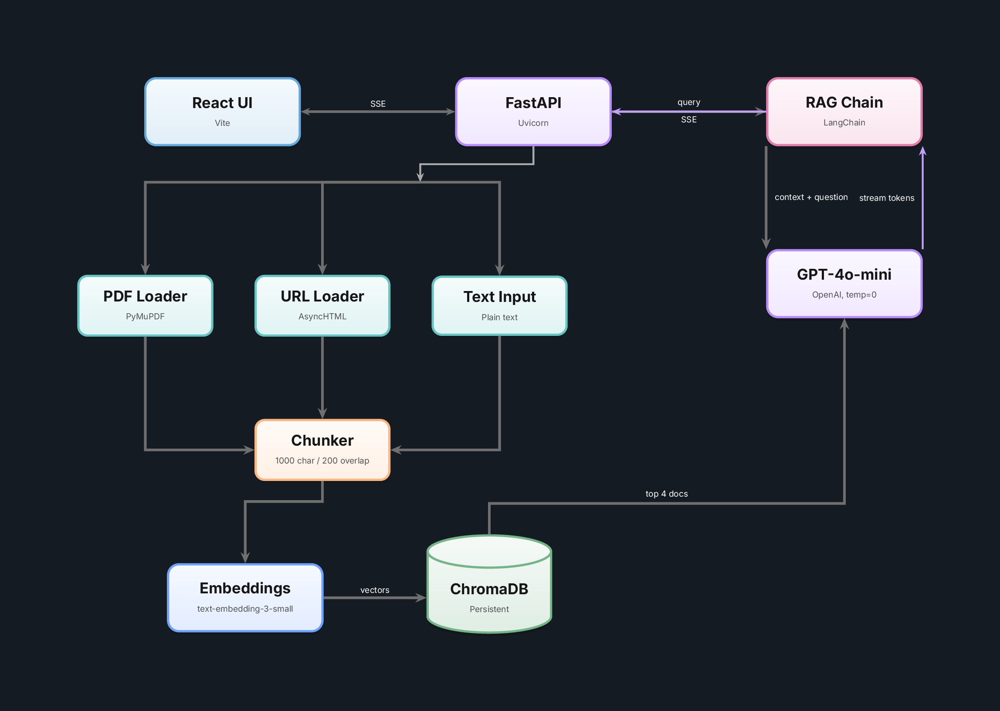

<!-- Badges -->


# rag-qa-app

Ask questions about your documents and get streaming answers with source citations.

**Live at [rag-qa-api.com](https://rag-qa-api.com)**

## Why

Reading through long PDFs, web pages, and notes to find a specific answer is slow. This app lets you upload your documents once, then ask natural language questions against them. Answers stream back in real time with citations pointing to exactly where the information came from.

## Features

- **Multi-format ingestion.** Upload PDFs, paste URLs, or add plain text.
- **Streaming answers.** Token by token via Server-Sent Events, so you see results immediately.
- **Source citations.** Every answer includes the source document, page number, and a text preview.
- **Conversation memory.** Follow-up questions use chat history for context.
- **Named collections.** Organize documents into separate searchable groups.

## Architecture



**Pipeline:** Documents are split into 1000 character chunks (200 overlap), embedded with `text-embedding-3-small`, and stored in ChromaDB. At query time, the top 4 similar chunks are retrieved and passed as context to `gpt-4o-mini`, which streams its response back.

## Stack

| Layer | Technology |
|-------|-----------|
| API | FastAPI 0.115, Uvicorn |
| RAG Pipeline | LangChain 0.3, LangChain OpenAI |
| Vector Store | ChromaDB 0.5 (persistent, on disk) |
| LLM | OpenAI gpt-4o-mini |
| Embeddings | OpenAI text-embedding-3-small |
| PDF Parsing | PyMuPDF |
| Frontend | React 19, Vite 8, Axios |
| Infrastructure | Docker Compose, Heroku |

## Getting Started

### Prerequisites

- Python 3.12+
- Node.js 20+
- An [OpenAI API key](https://platform.openai.com/api-keys)

### Backend

```bash
git clone https://github.com/danielbusnz-lgtm/rag-qa-app
cd rag-qa-app

python -m venv venv
source venv/bin/activate     # Windows: venv\Scripts\activate
pip install -r backend/requirements.txt
```

Create a `.env` file in the project root:

```
OPENAI_API_KEY=your-key-here
```

Start the server:

```bash
uvicorn backend.app.main:app --reload
```

The API runs at `http://localhost:8000`. Check `http://localhost:8000/health` to confirm.

### Frontend

```bash
cd frontend
npm install
npm run dev
```

Opens at `http://localhost:5173`.

### Docker

Run everything with one command:

```bash
docker-compose up --build
```

This starts the backend on port 8000 and frontend on port 5173. The vector store persists to `./chroma_db`.

## API Reference

| Method | Endpoint | Description |
|--------|----------|-------------|
| `GET` | `/health` | Health check |
| `POST` | `/ingest/pdf` | Upload a PDF (multipart form, field: `file`) |
| `POST` | `/ingest/url` | Ingest content from a URL |
| `POST` | `/ingest/text` | Ingest plain text |
| `POST` | `/query` | Ask a question (returns streaming SSE) |
| `GET` | `/collections` | List all document collections |
| `DELETE` | `/collections/{name}` | Delete a collection |

### Query example

```bash
curl -N -X POST http://localhost:8000/query \
  -H "Content-Type: application/json" \
  -d '{"question": "What are the key findings?", "collection_name": "default"}'
```

The response is a stream of Server-Sent Events with three message types: `token` (incremental text), `sources` (cited documents), and `[DONE]` (stream complete).

## Tests

```bash
pytest
```

5 tests covering document ingestion (text chunking, source metadata) and the RAG chain (collection routing, chat history).

## Project Structure

```
├── backend/
│   ├── app/
│   │   ├── main.py              # FastAPI app, routes, lifespan
│   │   ├── models.py            # Pydantic request/response schemas
│   │   ├── ingestion.py         # PDF, URL, and text loading + chunking
│   │   ├── retrieval.py         # ChromaDB vector store management
│   │   └── chain.py             # RAG pipeline and LLM streaming
│   ├── tests/
│   │   ├── test_ingestion.py    # Text chunking, source metadata
│   │   └── test_chain.py        # Collection routing, chat history
│   ├── Dockerfile
│   ├── Procfile                 # Heroku deployment
│   └── requirements.txt
├── frontend/
│   ├── src/
│   │   ├── App.jsx              # Main React component
│   │   ├── App.css
│   │   ├── main.jsx             # Entry point
│   │   └── index.css
│   ├── public/
│   │   ├── favicon.svg
│   │   └── icons.svg
│   ├── index.html
│   ├── vite.config.js
│   └── package.json
├── diagrams/
│   └── architecture.tex         # LaTeX architecture diagram (TikZ)
├── docker-compose.yml
├── conftest.py                  # Pytest root config
├── pytest.ini
├── .env.example
└── README.md
```

## Future Plans

**Retrieval quality**
- Evaluation pipeline using RAGAS to measure retrieval precision, answer faithfulness, and hallucination rate across a test dataset, with scores displayed on a dashboard page
- Hybrid search combining BM25 keyword search with vector similarity using reciprocal rank fusion
- Cross-encoder reranking step (Cohere Rerank or local `sentence-transformers` model) between retrieval and generation
- Configurable chunking strategies (fixed-size, semantic, parent-document retriever) with a settings panel to compare answer quality across methods

**Observability and evaluation**
- Debug view showing retrieved chunks, similarity scores, and which parts of the answer came from which source
- OpenTelemetry tracing across retrieval, reranking, and generation steps
- Per-query token usage logging and cumulative cost tracking on an admin page

**Backend**
- Async ingestion with job status tracking for large documents (background tasks with progress via WebSocket)
- Multi-model support (OpenAI, Anthropic, Ollama) behind a provider-agnostic interface
- Document management within collections (list, delete, inspect individual documents with metadata)
- Server-side conversation persistence with session IDs and a conversation history sidebar

**Frontend**
- UI redesign with shadcn/ui, Tailwind, and TypeScript. Dark theme, sidebar for collections and conversations, collapsible source/debug panel
- Markdown rendering in answers with syntax-highlighted code blocks (`react-markdown`)
- Drag-and-drop document upload with progress indicators

**Infrastructure**
- CI/CD pipeline via GitHub Actions (lint with `ruff`, run `pytest`, build Docker image, deploy on push to main)
- Separate production and dev dependencies (`pyproject.toml` with optional groups)
- Environment-based API URL configuration for the frontend (`VITE_API_URL`)
